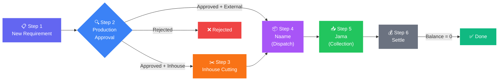
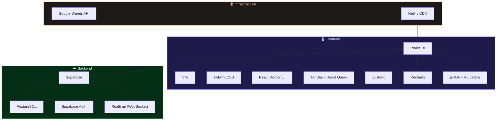
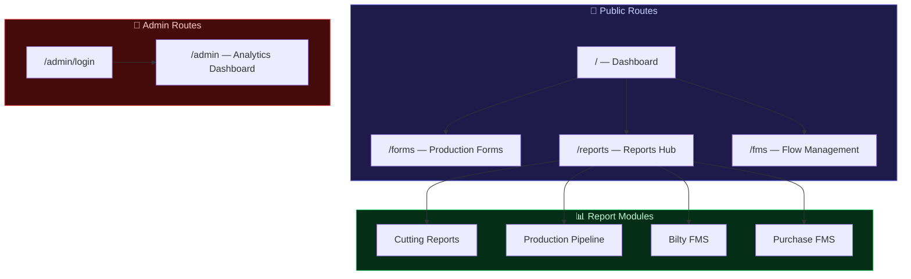
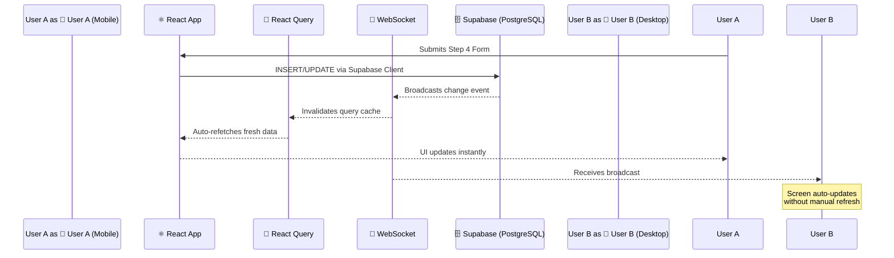

<p align="center">
  
</p>

<h1 align="center">Ketan — Production Management System</h1>

<p align="center">
  <strong>End-to-end garment production tracking — from requirement to settlement.</strong>
</p>

<p align="center">
  <a href="#-features"></a>
  <a href="#-tech-stack"></a>
  <a href="#-tech-stack"></a>
  <a href="#-tech-stack"></a>
  <a href="#-tech-stack"></a>
  <a href="#-deployment"></a>
</p>

<p align="center">
  
  
  
  
  
</p>

---

## 🎯 What is Ketan?

**Ketan** (formerly PMS Pro) is a **cloud-based, mobile-first Progressive Web App** built for garment manufacturing businesses. It digitizes the entire production lifecycle — replacing paper registers, WhatsApp chaos, and disconnected Excel sheets with a single, real-time system.

> *Ketan tells you **exactly** where every job is, who has it, and whether it's on time — at any moment, from any device.*

<br/>

## ❓ The Problem

| Stage | Traditional Method | Problem |
|:------|:-------------------|:--------|
| New Requirement | Written in registers | Easily lost or forgotten |
| Fabric Approval | Phone calls & WhatsApp | Confusion, no audit trail |
| Cutting | Manual tallies | Inaccurate piece counts |
| Dispatch to Karigar | No dispatch log | Zero lead-time tracking |
| Goods Collection | Manual reconciliation | Quantity disputes |
| Settlement | Paper-based accounting | Delays, loss of pieces |

**Result:** Lost jobs, delivery delays, disputes, and zero bottleneck visibility.

**Ketan solves all of this.**

<br/>

## ✨ Features

<table>
<tr>
<td width="50%">

### 📊 Live Dashboard
- Real-time job tracking with instant search
- Date range, step, and status filters
- "Aaj Ke Naame" — daily dispatch log
- Interactive analytics charts
- Pull-to-refresh on mobile

</td>
<td width="50%">

### 📝 Smart Production Forms
- 6-step guided data entry
- Color-coded step selector
- 3-level cascading item catalog
- Multi-size quantity support
- Confirmation popup before submission

</td>
</tr>
<tr>
<td width="50%">

### ✂️ Cutting Reports
- Pending/Completed cutting job views
- Quick cutting entry from report
- **Hisab PDF Generator** — auto-calculated bills
- Per-person productivity tracking

</td>
<td width="50%">

### 🏭 Production Pipeline
- Visual pipeline-by-stage overview
- Thekedar workload insights
- Category-based filtering
- Late job indicators with pulse animation

</td>
</tr>
<tr>
<td width="50%">

### 📈 Admin Analytics Dashboard
- 10+ interactive chart sections
- Executive KPI bar
- GitHub-style activity heatmap
- Bottleneck jobs table
- Raw data explorer + CSV export

</td>
<td width="50%">

### ⚡ Smart Delay Detection
- Working-hours-aware SLA engine
- Mon–Sat, 10 AM–7 PM calculation
- Auto-flags late jobs per step
- Planned vs. actual date comparison

</td>
</tr>
<tr>
<td width="50%">

### 🔄 Google Sheets Sync
- Bi-directional push/pull
- Legacy data migration support
- One-click from Dashboard

</td>
<td width="50%">

### 🌐 Internationalization (i18n)
- Full English & Hindi support
- Instant language switching
- Bilingual production-floor ready

</td>
</tr>
</table>

### Additional Modules

| Module | Description |
|:-------|:------------|
| 🔐 **Admin Auth** | Supabase Auth with session persistence, protected routes |
| 📦 **Bilty FMS** | Logistics & transit document tracking with photo upload |
| 🛒 **Purchase FMS** | Procurement pipeline — Requirement → Order → GI → Follow-Up |
| ⚙️ **Master Data** | Admin-managed dropdowns — personnel, catalog, thekedars |

<br/>

## 🔄 The 6-Step Production Pipeline

Every job follows a deterministic state machine through the production lifecycle:



> **Smart Routing:** Step 3 is conditional — if cutting is done externally by the thekedar, the job skips directly from Step 2 → Step 4.

<br/>

## ⏱️ Delay Detection Engine

The built-in time intelligence engine calculates delays using **working hours only**, excluding non-business time:

```
📅 Working Days:  Monday – Saturday
🕙 Working Hours: 10:00 AM – 7:00 PM (9 hrs/day)
🚫 Sundays:       Completely excluded
```

| Step | Stage | Max Allowed Time |
|:----:|:------|:-----------------|
| 2 | Pending Approval | 27 hrs ≈ 3 working days |
| 3 | Pending Cutting | 18 hrs ≈ 2 working days |
| 4 | Pending Naame | 18 hrs ≈ 2 working days |
| 5 | Pending Jama | 126 hrs ≈ 14 working days |
| 6 | Pending Settle | 27 hrs ≈ 3 working days |

**Status Indicators:** 🟡 On Track &nbsp;·&nbsp; 🔴 Late &nbsp;·&nbsp; 🟢 Complete

<br/>

## 🛠️ Tech Stack



| Layer | Technology |
|:------|:-----------|
| **UI Framework** | React 18 with SWC compiler |
| **Build Tool** | Vite |
| **Styling** | TailwindCSS 3.x |
| **Routing** | React Router v6 |
| **Server State** | TanStack React Query v5 |
| **UI State** | Zustand |
| **Database** | Supabase (PostgreSQL) |
| **Auth** | Supabase Auth (email/password) |
| **Real-time** | Supabase Realtime (WebSocket) |
| **Charts** | Recharts |
| **PDF Export** | jsPDF + jspdf-autotable |
| **Image Crop** | react-easy-crop |
| **Deployment** | Netlify CDN |
| **Data Sync** | Google Sheets API v4 |

<br/>

## 📁 Project Structure

```
pmspms/
├── public/
│   ├── ketan_logo.png          # Brand logo
│   ├── manifest.json           # PWA manifest
│   └── _redirects              # Netlify SPA routing
│
├── src/
│   ├── components/
│   │   ├── Layout.jsx          # App shell + bottom nav
│   │   ├── JobCard.jsx         # Job card with timeline
│   │   ├── StepBadge.jsx       # Color-coded step indicator
│   │   ├── SplashScreen.jsx    # Animated brand intro
│   │   ├── AnalyticsHub.jsx    # Dashboard chart widgets
│   │   ├── Toast.jsx           # Notification system
│   │   ├── Skeleton.jsx        # Loading placeholders
│   │   ├── AdminRoute.jsx      # Auth-protected route wrapper
│   │   ├── LanguageSwitcher.jsx # EN/HI toggle
│   │   └── fms/                # FMS sub-components
│   │
│   ├── pages/
│   │   ├── Dashboard.jsx       # Live job dashboard (34KB)
│   │   ├── Forms.jsx           # 6-step production forms (49KB)
│   │   ├── CuttingReports.jsx  # Cutting tracking + Hisab
│   │   ├── ProductionReport.jsx # Pipeline & thekedar views
│   │   ├── Reports.jsx         # Reports hub
│   │   ├── FMS.jsx             # Flow Management System
│   │   ├── AdminDashboard.jsx  # Analytics command center (86KB)
│   │   ├── AdminLogin.jsx      # Secure admin login
│   │   └── fms/                # Bilty & Purchase FMS pages
│   │
│   ├── hooks/
│   │   ├── useJobs.js          # Job data fetching & mutations
│   │   ├── useJobsRealtime.js  # WebSocket subscription
│   │   ├── useMasterData.js    # Admin config data
│   │   ├── usePullToRefresh.js # Mobile pull-to-refresh
│   │   ├── useBiltyFMS.js      # Logistics data hook
│   │   └── usePurchaseFMS.js   # Procurement data hook
│   │
│   ├── store/
│   │   ├── useAuthStore.js     # Auth state (Zustand)
│   │   └── useUIStore.js       # UI state (Zustand)
│   │
│   ├── utils/
│   │   ├── workingHours.js     # ⭐ Working hours time engine
│   │   ├── jobLogic.js         # Step detection & status
│   │   ├── db.js               # Supabase CRUD operations
│   │   ├── sync.js             # Google Sheets sync engine
│   │   ├── sheets.js           # Sheets API integration
│   │   ├── constants.js        # Step labels, people, mappings
│   │   ├── supabase.js         # Supabase client init
│   │   └── helpers.js          # General utilities
│   │
│   ├── i18n/
│   │   ├── translations.js     # EN + HI translations (800+ keys)
│   │   └── LanguageContext.jsx  # Language provider
│   │
│   ├── lib/
│   │   └── queryClient.js      # React Query configuration
│   │
│   ├── App.jsx                 # Root routing
│   ├── main.jsx                # Entry point
│   └── index.css               # Global styles
│
├── index.html                  # HTML entry with PWA meta
├── vite.config.js              # Vite + SWC configuration
├── tailwind.config.js          # Tailwind configuration
├── postcss.config.js           # PostCSS pipeline
├── netlify.toml                # Deployment configuration
└── package.json                # Dependencies & scripts
```

<br/>

## 🚀 Getting Started

### Prerequisites

- **Node.js** ≥ 18.x
- **npm** ≥ 9.x
- A **Supabase** project (with the `jobs` table configured)

### Installation

```bash
# 1. Clone the repository
git clone https://github.com/your-username/pmspms.git
cd pmspms

# 2. Install dependencies
npm install

# 3. Set up environment variables
cp .env.example .env.local
```

### Environment Variables

Create a `.env.local` file with your Supabase credentials:

```env
VITE_SUPABASE_URL=https://your-project.supabase.co
VITE_SUPABASE_ANON_KEY=your-anon-key-here
```

### Development

```bash
# Start the dev server
npm run dev

# Lint the codebase
npm run lint

# Build for production
npm run build

# Preview production build
npm run preview
```

The app will be available at `http://localhost:5173`

<br/>

## 🌐 Deployment

Ketan is deployed on **Netlify** with the following configuration:

| Setting | Value |
|:--------|:------|
| Build Command | `npm run build` |
| Publish Directory | `dist` |
| SPA Redirects | `/* → /index.html` (200) |

Simply connect your GitHub repo to Netlify — deploys happen automatically on push.

<br/>

## 🗺️ Sitemap



<br/>

## 👥 User Roles

| Role | Access Level |
|:-----|:-------------|
| **Production Team** | View jobs, fill step forms, view reports — *no login required* |
| **Admin** | Everything above + Analytics, Raw Data, CSV Export, Master Data, Data Correction — *password protected* |

<br/>

## 🏭 Who Is This For?

<table>
<tr><td>👔</td><td><strong>Business Owner</strong></td><td>KPIs, analytics, bottleneck visibility from the Admin Dashboard</td></tr>
<tr><td>🏗️</td><td><strong>Production Manager</strong></td><td>Pipeline monitoring, late job alerts, production approvals</td></tr>
<tr><td>📋</td><td><strong>Sales / Planning</strong></td><td>Raise new requirements (Step 1)</td></tr>
<tr><td>✂️</td><td><strong>Cutting Person</strong></td><td>Log cutting entries (Step 3), generate Hisab PDF</td></tr>
<tr><td>📦</td><td><strong>Dispatch Manager</strong></td><td>Log naame to karigar (Step 4)</td></tr>
<tr><td>📥</td><td><strong>Store / Jama Person</strong></td><td>Log goods received back (Step 5)</td></tr>
<tr><td>💰</td><td><strong>Accounts</strong></td><td>Handle settlements (Step 6)</td></tr>
</table>

<br/>

## 💎 Key Business Benefits

| Benefit | Impact |
|:--------|:-------|
| 🚫 Zero Lost Jobs | Every requirement digitally recorded from Day 1 |
| 👁️ Instant Visibility | Check any job's status from your phone — no calls needed |
| 📌 Accountability | Every step records *who* did it and *when* |
| ⏰ Proactive Alerts | Flags delayed jobs *before* they become critical |
| 📏 Accurate Piece Tracking | Multi-size counts from cutting through settlement |
| 📊 Karigar Performance | Data-driven decisions on work allocation |
| 📄 Hisab PDF | Auto-calculated cutting bills, downloadable instantly |
| ☁️ Always Backed Up | Cloud database — no hardware risk |
| 📱 No Hardware Needed | Works on any smartphone browser |
| 📈 Scales Infinitely | 10 jobs or 10,000 — same speed, same reliability |

<br/>

## 🔧 Real-Time Architecture



<br/>

## 📜 Scripts

| Command | Description |
|:--------|:------------|
| `npm run dev` | Start development server (Vite HMR) |
| `npm run build` | Production build to `dist/` |
| `npm run preview` | Preview production build locally |
| `npm run lint` | Run ESLint across the codebase |

<br/>

## 🤝 Contributing

This is a private project. If you've been granted access:

1. **Fork** the repo
2. Create a **feature branch** (`git checkout -b feature/amazing-feature`)
3. **Commit** your changes (`git commit -m 'feat: add amazing feature'`)
4. **Push** to the branch (`git push origin feature/amazing-feature`)
5. Open a **Pull Request**

<br/>

## 📄 License

This project is **private and proprietary**. All rights reserved.

<br/>

---

<p align="center">
  <sub>Built with ❤️ for the garment manufacturing floor.</sub>
  <br/>
  <sub>Designed for clarity, speed, and accountability.</sub>
</p>

<p align="center">
  
  
  
</p>
